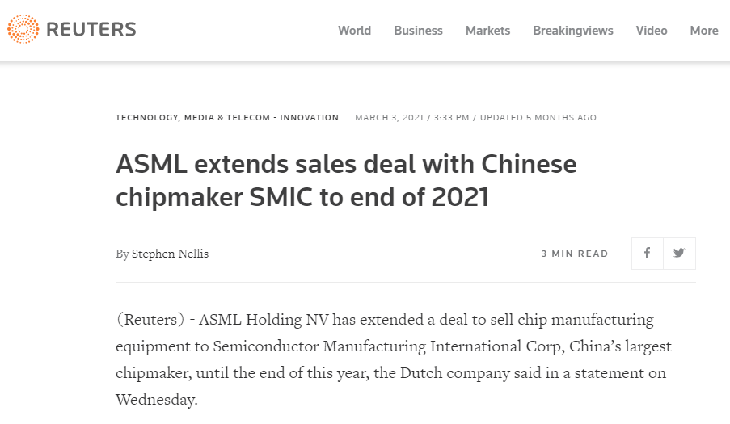
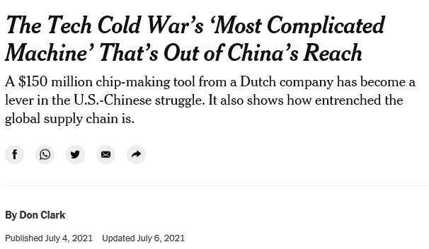

```{r xaringan-themer, include=FALSE, warning=FALSE}
library(xaringanthemer)
style_solarized_light(
  code_font_family = "Fira Code",
  text_font_size = "1.5rem",
  colors = c(
  red = "#f34213",
  purple = "#3e2f5b",
  orange = "#ff8811",
  green = "#136f63",
  white = "#FFFFFF",
  blue="blue"),
  code_font_url = "https://cdn.jsdelivr.net/gh/tonsky/FiraCode@2/distr/fira_code.css"
)
```


# Dual-use export control <br><br>


.pull-left[]

.pull-right[]


---

# SME as chokepoints <br><br>


.pull-left[]

.pull-right["The question is whether Europe will align with the U.S. government’s approach of
expanding export restrictions via these chokepoints."]


---

# Sanctions-busting and alliance  <br><br>


```{r echo=FALSE, message=FALSE}
x=magick::image_read_pdf("ducplot_chirus.pdf",
                       pages = 1)
magick::image_resize(x,"x70%")
```


---


# Sanctions-busting and alliance <br><br>

--

.pull-left[Closest allies are sanctions' worst enemies (Early 2015)

 Better access

 Political cover

 Distorted markets
]

--

.pull-right[ US sanctions & third-party compliance (Peterson 2021)

Opportunity vs. willingness

Variation across different actors

Confounders
]


---


# Theory & hypotheses <br><br>

--

.pull-left[
All esle equal, allies are not more likely to bust dual-use sanctions

Allies are more trust-worthy

Cooperation & alliance

Secondary sanctions

]

--

.pull-right[
Relevant confounders:

Political distance -

Economic integration +

Conditional impact - 

]

---

class: center, middle

# Research design


---
# Data & method <br><br>


Sample: US sanctions excluding irrelevant types (EUSANCT) 


--

Dependent Variable: CDU (proxied by EU list)


--

Independent Variables: Alliance; Political distance; Economic integration


--

Lagged dependent variable (LDV) models 

---

# Histograms 

```{r echo=FALSE, message=FALSE}
x=magick::image_read_pdf("histall.pdf",
                       pages = 1)
magick::image_resize(x,"x60%")
```


---

class: center, middle

# Main results


---

# Alliance 

```{r echo=FALSE, fig.height=3, fig.width=5, message=FALSE}
x=magick::image_read_pdf("usally_me.pdf",
                       pages = 1)
magick::image_resize(x,"x90%")
```


---
# Political distance and economic integration

```{r echo=FALSE, fig.height=3, fig.width=5, message=FALSE}
x=magick::image_read_pdf("idealintegration_short.pdf",
                       pages = 1)
magick::image_resize(x,"x90%")
```


---
# Conclusion <br><br>


--

Allies are not sanctions’ worst enemies 


--

Target states’ integration is a critical factor

--

Potential snowball effects